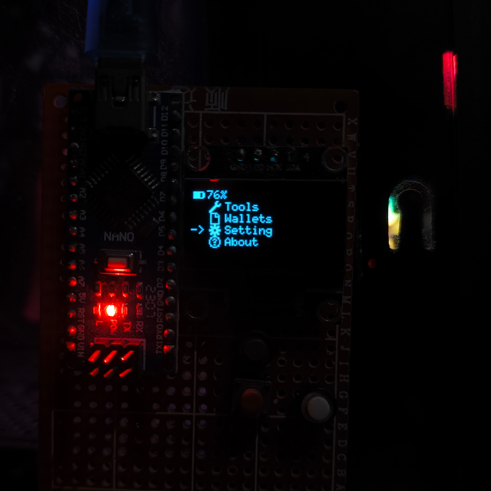

# Flipper Core - Firmware 0x00A

I recommend uploading to Arduino using Linux, as I've only tested it on that. However, if you have Windows experience uploading this codebase via arduino-cli (or Arduino IDE*), please submit a PR showing the steps.

## Installing
Install lib `U8g2lib` with:
```bash
$ arduino-cli lib install U8g2
```

Install `arduino:avr` with:
```bash
$ arduino-cli core install arduino:avr
```

## Upload code to arduino
Using `root` with `sudo -E` to lazy upload. (only for arduino yet)
```bash
$ sudo -E make
```

## screenshots

